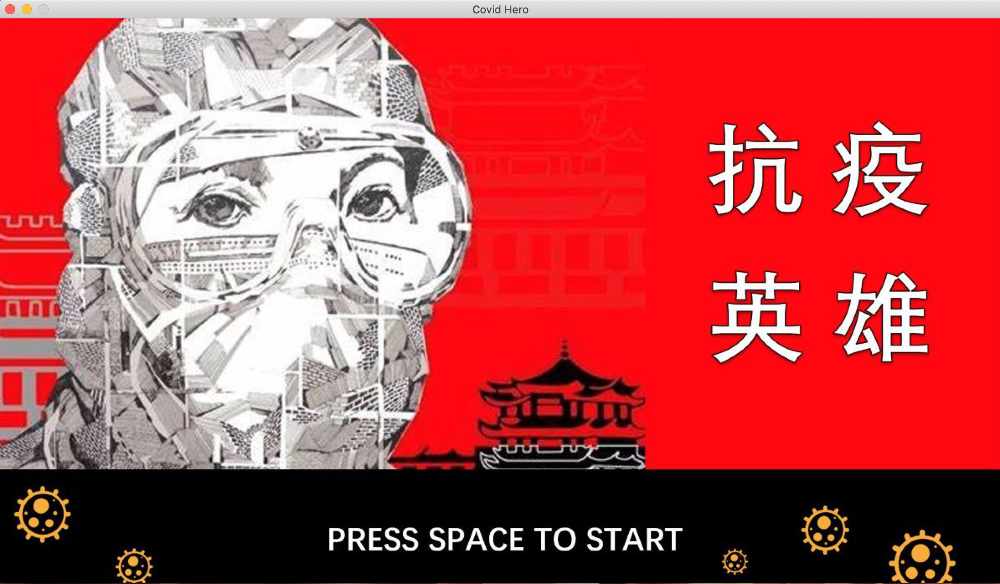
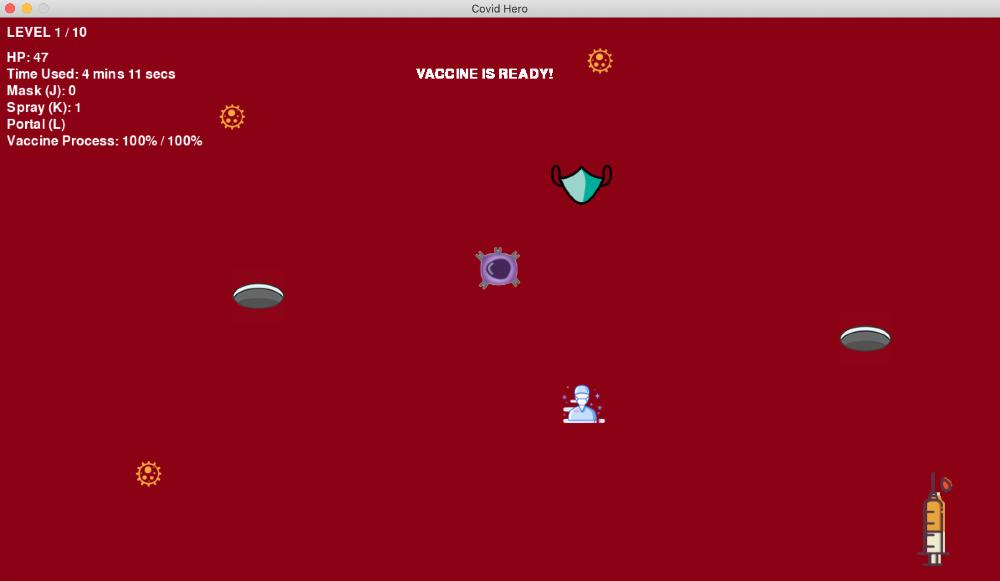

# Covid Hero

Project Date: July 2020

## Description

 

Covid Hero is a Python game created as a class project for an introductory Python course at Peking University. The game was created with [Pygame Zero](https://pygame-zero.readthedocs.io/en/stable/index.html), an abstraction over Pygame.

Covid Hero is a fun and educational way to get started with Python programming while also learning about the ongoing pandemic. The game pays tribute to frontline healthcare professionals who have been working tirelessly to fight the virus.

The demo video of the game can be found [here](https://www.bilibili.com/video/BV1XT4y177eE?p=14).

## How to Install and Play

1. `pip install pgzero`
2. `git clone git@github.com:ruichen199801/covid-hero.git`
3. `cd covid-hero`
4. `pgzrun covidhero.py`

## Game Rules

 

Covid-19 is breaking out, and you are a doctor fighting against the virus on the frontline. Your objective is to stay alive and develop the vaccine as soon as possible. Here are the basic rules of the game:

* Use "W""A""S""D" to control movement of the character.
* Collect antibodies to accelerate the vaccine development process.
* Once the progress bar reaches 100%, the vaccine appears. Collect the vaccine to win!
* Watch out for viruses and dodge them while collecting antibodies. If your HP drops to 0, you lose!

Here are some additional features of the game:

* Mutated viruses: These viruses have a larger size and deal more damage.
* Items: Masks grant the player immunity to viruses within 3 seconds. Disinfectants instantly clear viruses in a given range. Portals appear in pairs and allow teleportation from one end to the other.
* Difficulty levels: There are 10 levels plus a tutorial level.
* Leaderboard: Rankings are based on the time players spend on each game.

## Other Authors

- Yunjie Qian
- Hongcheng Wang
- Zixin Zeng
